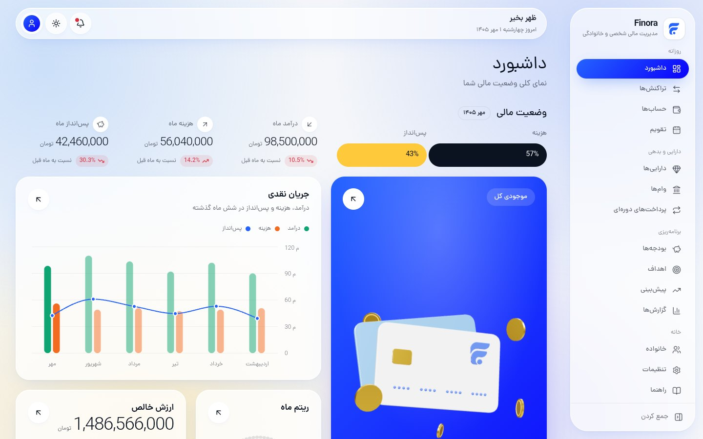
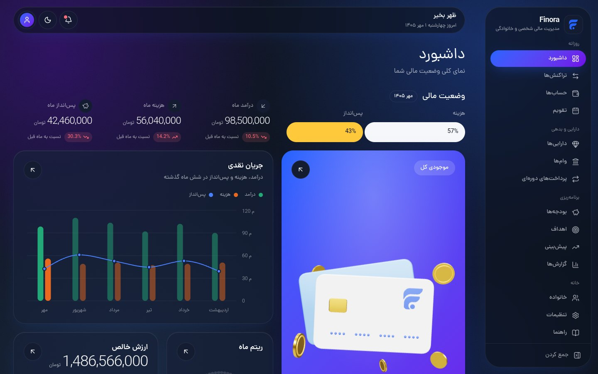
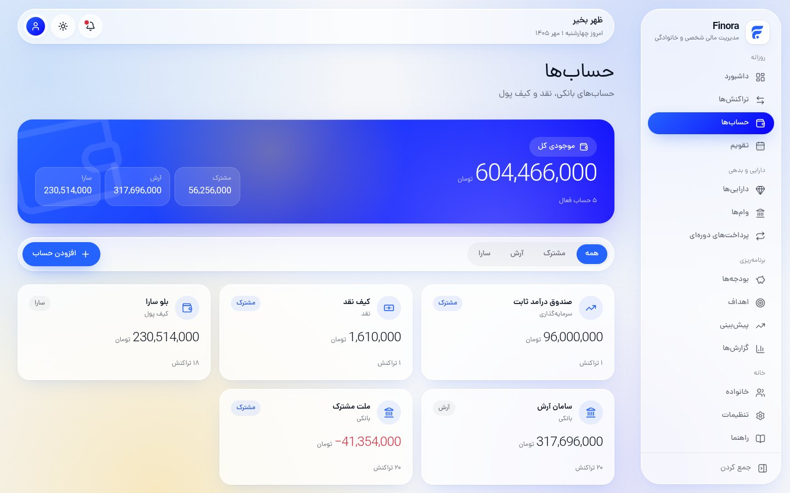
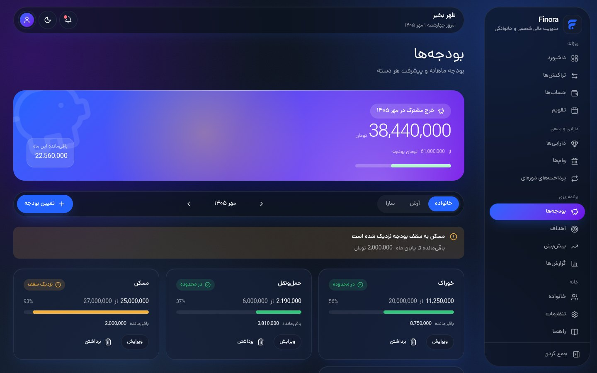
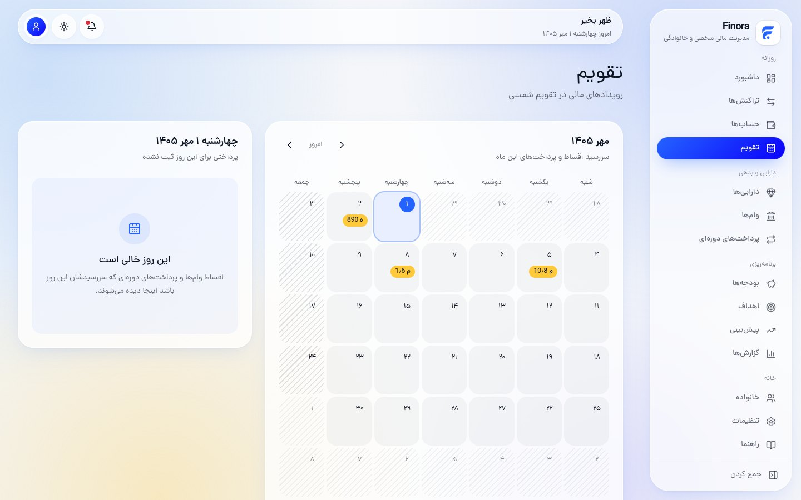
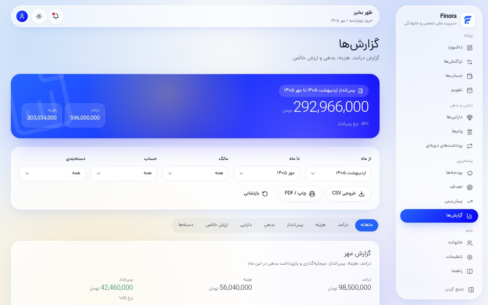
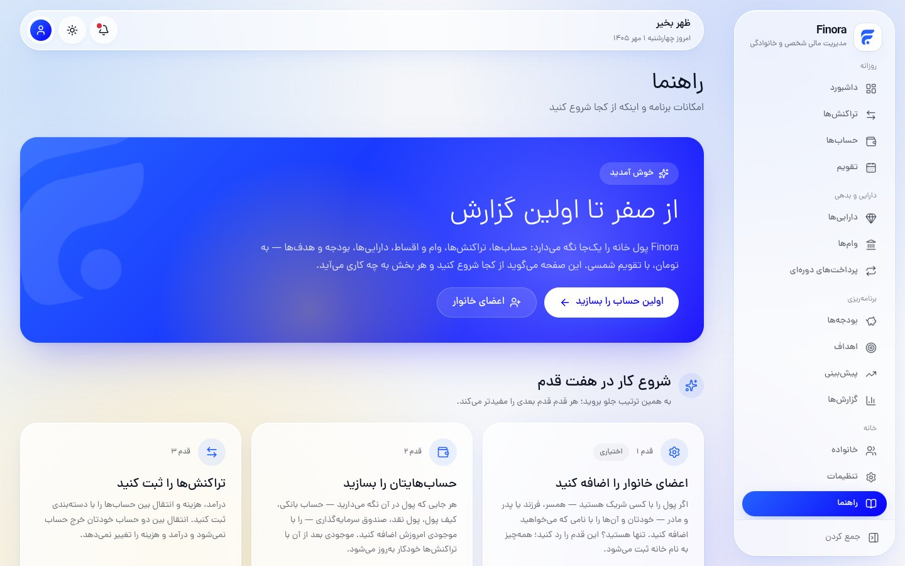
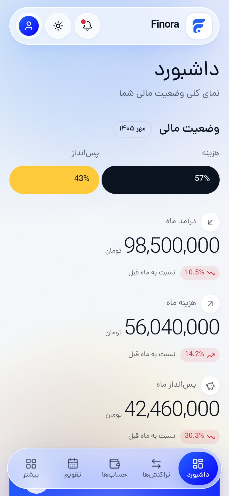
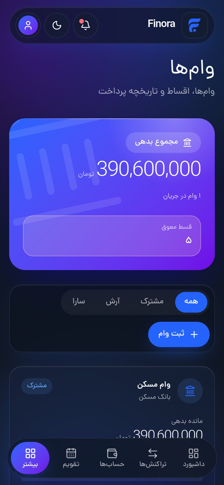

<div align="center">


# Finora

**A Persian-first personal and household finance manager — self-hosted, right-to-left, on the Jalali calendar.**

**English** · [فارسی](./README.fa.md)

<br />



</div>

---

## About

Finora keeps a household's money in one place: where it is, how it moves and
where it is heading. It was built for Persian-speaking households, so it is not
a translated Western app. It is designed right-to-left from the start, amounts
are in Toman, and every date is on the Jalali calendar.

It is self-hosted: one `docker compose up` runs the app and its PostgreSQL
database on your own machine, and your financial data never leaves it.

Nobody is built in. Use it on your own, or add the people you share money with
under whatever names you choose (a partner, children, parents). Every record
then belongs to one of them or to the household as a whole.

## Features

| | |
| --- | --- |
| **Dashboard** | Balance, this month's income and spending, net worth, cash flow and upcoming payments on one bento board, with a 3D balance card. |
| **Accounts & transactions** | Bank accounts, wallets, cash and investment funds. Balances are always derived from transactions, never typed in. Transfers are never counted as spending. |
| **Loans** | Automatic instalment schedules, remaining debt, overdue instalments, and one-click payment. |
| **Recurring payments** | Rent, subscriptions and bills, monthly, weekly, yearly or custom. Each due date turns into a transaction when paid. |
| **Budgets** | Monthly limits per category for the household and for each person, with alerts and rollover of unspent money. |
| **Assets** | Gold, currency, cars and investments. Price history is kept, so today's price never rewrites the past. |
| **Goals** | Savings goals with deadlines, the monthly amount needed, and contributions. |
| **Forecast** | Cash flow for the coming months, from income, fixed payments and budgets, with shortfall warnings. |
| **Calendar** | Every due date on a Jalali month grid. |
| **Reports** | Income, spending, debt, assets and net worth over any range, with CSV export. |
| **Household** | Shared and personal spending, and what each person put into the household. It is informational only, never a scoreboard. |
| **Guide** | An in-app walkthrough of the features and how to get started. |

It also has light and dark themes with a circular reveal transition, an
animated ambient background, digit grouping in every amount field, and a
mobile layout with a floating dock.

## Screenshots

<table>
  <tr>
    <td width="50%"></td>
    <td width="50%"></td>
  </tr>
  <tr>
    <td></td>
    <td></td>
  </tr>
  <tr>
    <td></td>
    <td></td>
  </tr>
</table>

<p align="center">
  
  &nbsp;&nbsp;
  
</p>

## Tech stack

<p align="center">
  
</p>

<p align="center">
  
  
  
  
  
  
  
  
  
  
  
  
  
  
  
  
  
  
</p>

| Concern | Choice |
| --- | --- |
| Framework | Next.js (App Router), React, TypeScript |
| Styling | Tailwind CSS v4 with CSS-variable design tokens, shadcn/ui on Radix primitives |
| Data | PostgreSQL via Prisma |
| Charts | Recharts |
| Motion & 3D | Motion for layout, GSAP for the dashboard entrance, View Transitions for the theme, three.js for the balance card |
| Forms | React Hook Form + Zod |
| Typeface | Dana, self-hosted via `next/font/local` |
| Tests | Vitest (unit and database integration), Playwright acceptance checks |
| Runtime | Docker Compose (app + postgres) |

### Engineering notes

- **Money is never a float.** Every amount is stored as an integer number of
  Rial (`BigInt`) and shown as Toman. No amount passes through a JavaScript
  `number`.
- **Transfers are not expenses.** Moving money between your own accounts never
  changes income, spending or net worth. Database `CHECK` constraints and the
  API both enforce this.
- **History stays historical.** A new asset price, a renamed category or an
  edited loan never rewrites what already happened.
- **Jalali at the edges.** Dates are stored as UTC and converted to and from
  Jalali only at the presentation boundary.

## Getting started

Requirements: Docker with Compose.

```bash
git clone https://github.com/rezaabdollahi7/finora.git
cd finora
cp .env.example .env
docker compose up
```

Open <http://localhost:3000>, then go to **راهنما (Guide)** in the sidebar.
It walks through the first steps: add household members if you want them,
create your accounts, then record transactions.

`docker compose up` is also all that is needed **after pulling changes**. On
every start the container reconciles dependencies, regenerates the Prisma
client, applies pending migrations and re-runs the idempotent seed. Nothing
is ever reset.

### Without Docker

Requirements: Node.js 22 and PostgreSQL 17. Set `DATABASE_URL` in `.env`.

```bash
npm install
npm run db:deploy   # apply pending migrations
npm run db:seed     # default categories; idempotent
npm run dev
```

## Scripts

| Script | Purpose |
| --- | --- |
| `npm run dev` | Development server |
| `npm run build` | Production build |
| `npm run start` | Serve the production build |
| `npm run lint` | ESLint |
| `npm run typecheck` | TypeScript, no emit |
| `npm run format` | Prettier |
| `npm run test` | Unit and integration tests (needs the database) |
| `npm run db:migrate` | Create a migration from schema changes |
| `npm run db:deploy` | Apply pending migrations |
| `npm run db:seed` | Seed the default categories |
| `npm run acceptance` | End-to-end acceptance checks against a running build |

`npm run acceptance` runs against a started build (`npm run build && npm run
start`). It checks compose, migrations, every route, RTL and the typeface,
three viewports, both themes and a clean console. It reads `BASE_URL` and, if
set, `CHROMIUM_PATH`.

## Security

**Finora has no login.** Anyone who can reach its port can read and change
everything. Run it on your home network, behind a VPN, or behind a reverse
proxy with authentication, never directly on the internet.
[`docs/OPERATIONS.md`](./docs/OPERATIONS.md) covers deployment and backups.

## Troubleshooting

**`port is already allocated`**: something else is using 5432 or 3000,
usually a local PostgreSQL. Change the host ports in `.env`. Inside Docker
the app still reaches the database at `db:5432`.

```bash
POSTGRES_PORT=5433
APP_PORT=3001
```

**`Can't resolve '@/generated/prisma/client'` or `tsx: not found` in
Docker**: recreate the container with
`docker compose up --build --force-recreate`. If the error persists,
`docker compose down -v` clears the stale volumes, but it also deletes the
database.

## Documentation

- [`docs/ARCHITECTURE.md`](./docs/ARCHITECTURE.md): technical decisions and folder layout
- [`docs/DESIGN_SYSTEM.md`](./docs/DESIGN_SYSTEM.md): the visual language and tokens
- [`docs/OPERATIONS.md`](./docs/OPERATIONS.md): running, backups, audits
- [`SPRINTS.md`](./SPRINTS.md): the implementation roadmap
- [`CLAUDE.md`](./CLAUDE.md): project rules
